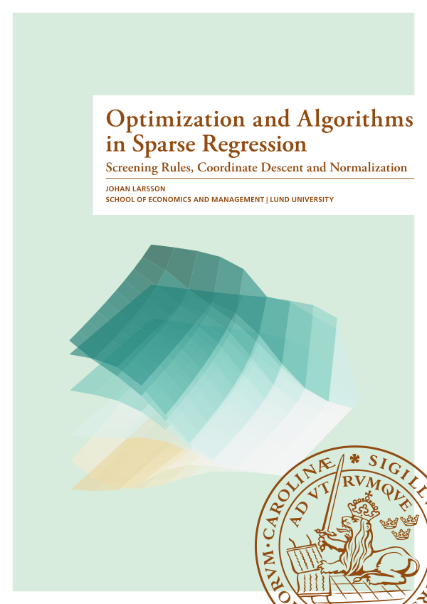
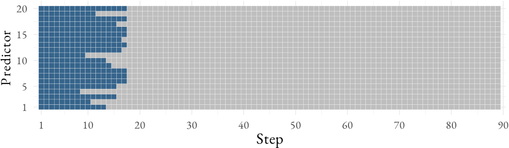
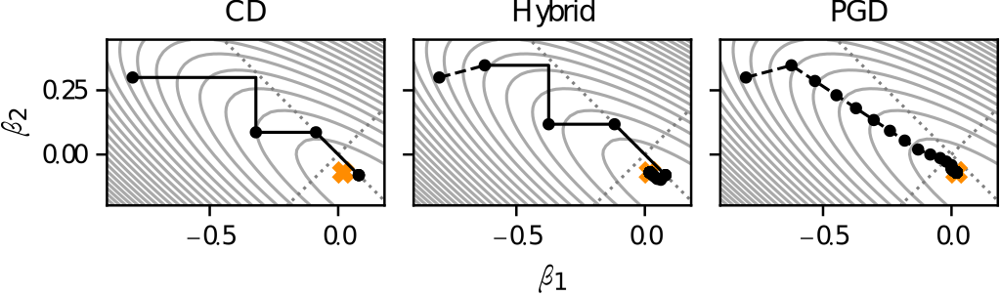

**Spoiler alert:** I passed my defense! 🎉

My PhD thesis is now published and available for download [@larsson2024]! It is
the culmination of five years of research on optimization other related
numerical algoritms for sparse regression, in particular the lasso and sorted
l-one penalized estimation (SLOPE).

{#fig-cover
width=300px .lightbox .border}

In the following sections I will give an overview over the papers that are
included in the thesis. This a somewhat abridged version of the paper summary
section in the actual thesis and comes without a lengthy introduction to the
field and these topics. If you are interested in that, I suggest you read the
thesis itself!

## Paper 1

The first of the papers introduces _the strong screening rule for SLOPE_
[@larsson2020b], which is the first screening rule for SLOPE. If you haven't
heard about screening rules before, they are algorithms that discard features
(predictors/variables) prior to fitting the model. They are remarkably effective
for sparse methods in the high-dimensional setting and typically offer speed ups
of several orders of magnitude in the high-dimensional setting. They were first
discovered for the lasso with @elghaoui2010a and have since proven to be a key
ingredient in making the lasso computationally efficient.

They are based on the following reasoning:

1. The solution to a sparse regression problem is, of course, _sparse_,
   particularly in the case when the number of features ($p$) outnumber the
   number of observations ($n$). For the lasso, for instance, the size of the
   support _must_ in fact be no larger than $n$.
2. We can often guess quite accurately which features have little chance of
   being in the support, for instance by looking at the correlation between the
   features and the response or the solution to a problem with a larger (or
   smaller) penalty.^[This is typically the case when we are fitting a
   regularization path. We start with a penalty that's large enough to make
   every coefficient zero and then progressively increase it.]
3. Even if we are wrong about which features are in the support, it is typically
   cheap to check if we made a mistake and refit with these features added back
   in.

This reasoning turns out to be pretty-much on spot and as a result screening
rules have turned out to be critical for good performance for the lasso and
related methods.

Screening rules are typically separated into _safe_ and _heuristic_ rules. Safe
rules guarantee that discarded features are in fact not in the optimal solution,
whereas heuristic rules do not. This division is something is something of a
misnomer, however, since it is easy to check optimality conditions after fitting
the model on the reduced set of features, catch any mistakes, and refit is
necessary. And because safe rules sacrifice effectiveness for safety together
with the fact that the optimality checks are not very expensive, it is my
experience that heuristic rules typically offer better performance. They can
even be used together.

The first heuristic screening rule for the lasso was introduced by
@tibshirani2012: _the strong screening rule_. And in the first paper of my
thesis, we extend this screening rule strategy to the problem of solving sorted
\(\ell_1\) penalized regression (SLOPE) [@bogdan2015].

I have provided some results from the first paper in @tbl-paper1-results. As you
can see, screening improves performance considerably and offers no computational
overhead even when it has little effect (as in the case of the physician data
set).

Table: Results from one of the experiments in the first paper [@larsson2020b],
showing time taken to fit a full SLOPE path to a few different data sets.
{#tbl-paper1-results}

| Dataset     | Model         |  $n$ |    $p$ | Time (No screening) | Time (Screening) |
| ----------- | ------------- | ---: | -----: | ------------------: | ---------------: |
| dorothea    | Logistic      |  800 |  88119 |                 914 |               14 |
| e2006-tfidf | Least squares | 3308 | 150358 |               43353 |             4944 |
| news20      | Multinomial   | 1000 |  62061 |                5485 |              517 |
| physician   | Poisson       | 4406 |     25 |                  34 |               34 |

## Paper 2

Screening rules are particularly effective when they are sequential, that is,
operate along the regularization path.^[The regularization path starts at the
point where all of the model's coefficients are zero and proceed until they are
almost not penalized at all.] But another possibility that had previously not
been explored is the idea of screening not only for the next step on the path,
but for _all_ of the remaining steps as well. This is the idea behind
_look-ahead screening rules_, which I introduce in the second paper of the
thesis, which is a short paper [@larsson2021]. We use the Gap-Safe screening
rule [@ndiaye2017] here. As the name suggests, it is a safe screening rule. This
means that if a feature is screened out, it is guaranteed to be zero in the
solution.

As I show in the paper, the results are quite promising (@fig-paper2),
especially since you get this kind of screening essentially for free (if you're
screening anyway).

{#fig-paper2
.lightbox}

## Paper 3

Even though the strong rule for the lasso is highly effective in general, there
is one area in which it struggles, namely, when features are highly correlated.
@tibshirani2012 in fact noted this themselves and motivated using a modified
technique: the working-set strategy (where the model is initially fit using the
ever-active set, rather than the strong set) because of this.

The reason for this is that the strong rule (and every other screening rules we
know of), ignores information about how close the features are to becoming
active. This is the motivation for the _Hessian screening rule_ that we
introduce in the third paper of the thesis [@larsson2022b]. The name stems from
the fact that we use second-order information about the optimization problem,
which involves the Hessian matrix $X^\intercal X$. The rule offers a better
estimate of the correlation vector, which in practice leads to better screening
performance.

## Paper 4

An ongoing problem in literature on optimization (including screening rules) is
that there are now so many methods to examine and so many different models and
datasets on which to compare them on, that it has become difficult to keep track
of which methods it is that actually do best on a given problem. You can easily
find a paper A that studies optimization methods X and Y on datasets I and II
and conclude that X is better than Y but then find another paper B, which
studies methods X, Y, and Z on datasets I and III and conclude that, actually, Y
is better than X and, by the way, Z happens to be best of them all. Then, later,
you find paper C, which claims that Z actually is considerably worse than X,
which in fact also performs better for data set IV. This confused state of
affairs is typically the result of authors having benchmarked their methods
using different hardware, programming languages for their implementations,
hyperparameters for their methods, and convergence criteria, to name a few of
the many possible sources of variation.

In short, there is a dire need for a framework through which this process can be
made simple, reproducible, and transparent. This is the motivation behind the
**benchopt** package, which we present in the fourth of this thesis' papers
[@moreau2022a].

The goal of benchopt is to make life easier for both researchers in optimization
and users of optimization software. For a researcher who has developed a new
optimization method for SLOPE, for instance, all you need to do is to write the
code for your solver (optimization method) and plug it into the existing
benchopt benchmark for SLOPE and run it. The package will then automatically
compare your method with all the other methods in the benchmark and output table
and plots of the results [@fig-paper4]. If you instead are a user who is
interested in using SLOPE for your applied work and want to know which algorithm
to use, you can either browse the extensive database of results that other users
have already uploaded or just download the benchmark and run it yourself on the
data that you are interested in using it for.

{#fig-paper4
.lightbox .fig-cap-location-bottom}

## Paper 5

Proximal coordinate descent is a very efficient optimization algorithm for
fitting the lasso, but it cannot handle the case when the penalty term is
non-separable, which is the case in SLOPE. In practice, this has reduced the
applicability of SLOPE to large data, which is unfortunate given the many
appealing properties of the model.

In paper 5 [@larsson2023], however, we present a way to circumvent this issue by
using a hybrid of proximal coordinate and proximal gradient descent. Our main
discovery is that if we fix the clusters and optimize over each cluster in turn,
rather than each feature, the problem becomes separable, which means that
coordinate descent can be used. And if we combine this with proximal gradient
descent steps, which allow us to discover the clusters, then we can guarantee
convergence and at the same time benefit from the efficiency of coordinate
descent.

The solver is illustrated for a two-dimensional SLOPE problem in @fig-paper5.
The orange cross marks the optimum. Dashed lines indicate PGD steps and solid
lines CD steps. Each dot marks a complete epoch, which may correspond to only a
single coefficient update for the CD and hybrid solvers if the coefficients flip
order. The CD algorithm converges quickly but is stuck after the third epoch.
The hybrid and PGD algorithms, meanwhile, reach convergence after 67 and 156
epochs respectively.

{#fig-paper5
width=700px .lightbox}

## Paper 6

The final paper of the thesis is a working paper in which we tackle the issue of
normalization of binary features. Normalization is necessary in order to put the
features on the same scale when dealing with regularized methods. What "same
scale" means, however, however, is not clear, yet has been met mostly with
neglect in the literature. We think that this is both surprising and problematic
given the almost universal use of normalization in regularized methods and the
apparent and large effects it has on the solution paths.

In our paper, we begin to bridge this knowledge gap by studying normalization
for the lasso and ridge regression when they are used on binary features
(features that only contain values 0 or 1) or mix of binary and normally
distributed features. What we find is that there is a large effect of
normalization with respect to the class balance of the features: the proportion
of ones to zeros (or vice versa). Both the lasso and the ridge estimators turn
out to be sensitive to this class balance and, depending on the type of
normalization used, have trouble recovering effects that are associated with
binary features as long as their class balance is severe enough [@fig-paper5].

![Estimated coefficients from lasso and ridge regression for a two-feature problem where one of the features has a quasi-normal distribution (values deterministically set via the quantile function), with standard deviation 1/2, and the other is a binary (quasi-Bernoulli) feature with class-balance $q$. The normal feature is standardized in every case, whereas the binary feature is scaled with $(q - q^2)^\delta$---its variance to the power of $\delta$. In other words, we have no scaling for $\delta=0$, standard deviation scaling when $\delta=1/2$, and variance-scaling when $\delta = 1$.](paper6-highlight.svg){#fig-paper6
width=700px .lightbox}

I will offer more details on this paper once work on it has been completed, but
I think the results are interesting and that this field is ripe for further
exploration.
